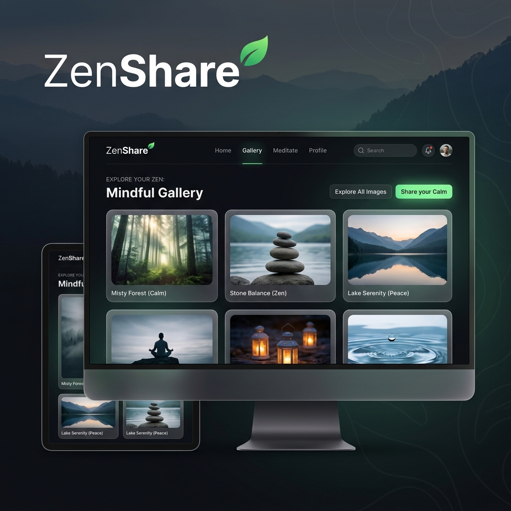

# ZenShare - Bildsharing Plattform



Eine komfortable, sichere und ästhetisch ansprechende Weboberfläche zum Hochladen, Teilen und Herunterladen von Bildern und ZIP-Archiven. 

Entwickelt mit **Node.js/Express** im Backend und **Vanilla JS/CSS (Glassmorphism-Theme)** im Frontend. Perfekt geeignet für den Betrieb auf einem Linux-Webserver.

---

## Features
* **Admin-Bereich**: Administrator kann neue Benutzer anlegen und bestehende Accounts löschen.
* **Gruppen-Freigabe**: Sichtbarkeit basiert auf dem Benutzerpasswort. Benutzer mit demselben Passwort können gegenseitig ihre Uploads sehen und herunterladen.
* **Komfortabler Upload**: Hochladen mehrerer Bilder per Drag & Drop oder Auswählen einer einzelnen ZIP-Datei (der Server entpackt sie automatisch und extrahiert nur gültige Bilder).
* **Einzel- & ZIP-Download**: Bilder können einzeln in Originalauflösung oder die gesamte Session als ZIP-Datei heruntergeladen werden.
* **Modernes Design**: Dark-Glassmorphism UI mit geschmeidigen Ladebalken-Animationen für den Upload-Fortschritt und responsivem Accordion-Layout.

---

## Installation & Lokaler Start

### Voraussetzungen
Stelle sicher, dass **Node.js (Version 18 oder neuer)** auf deinem System installiert ist.

### 1. Abhängigkeiten installieren
Führe diesen Befehl im Projektverzeichnis aus:
```bash
npm install
```

### 2. Anwendung starten
* **Entwicklungsmodus** (mit automatischem Neustart bei Code-Änderungen):
  ```bash
  npm run dev
  ```
* **Produktionsmodus**:
  ```bash
  npm start
  ```

Der Server ist standardmäßig unter **http://localhost:3000** erreichbar.

---

## Standard-Logins & Konfiguration

Beim ersten Start wird automatisch ein standardmäßiger Administrator-Account angelegt, falls noch kein Admin in der Datenbank existiert:

* **Benutzername**: `admin`
* **Passwort**: `admin123`

> [!WARNING]
> Melde dich nach dem ersten Start als `admin` an, gehe in den **Admin-Bereich**, erstelle einen neuen Admin-Account deiner Wahl und lösche anschließend den Standard-Account `admin` oder ändere das Passwort ab, um die Sicherheit deines Webservers zu gewährleisten.

### Datenhaltung
Sämtliche Benutzerdaten und Metadaten werden in `data/db.json` gespeichert. Die hochgeladenen Bilder werden im Ordner `uploads/<session-id>/` abgelegt. Es wird keine externe Datenbank benötigt.

---

## Linux Deployment (Nginx + PM2)

Um die Anwendung dauerhaft und sicher auf einem Linux-Server zu betreiben, empfiehlt sich folgendes Setup:

### 1. PM2 (Process Manager) installieren & starten
Installiere PM2 global auf deinem Server, um die Node.js-Anwendung im Hintergrund laufen zu lassen:
```bash
sudo npm install -pm2 -g
```
Starte die Anwendung über PM2:
```bash
pm2 start server.js --name "bildsharing"
```
Um sicherzustellen, dass die App bei einem Server-Neustart automatisch wieder hochfährt:
```bash
pm2 startup
pm2 save
```

### 2. Nginx als Reverse Proxy einrichten
Erstelle eine Nginx-Konfigurationsdatei (z.B. `/etc/nginx/sites-available/bildsharing`):

```nginx
server {
    listen 80;
    server_name deine-domain.de; # Hier deine Domain oder IP eintragen

    # Maximale Upload-Größe für große ZIP-Archive anpassen (z.B. 2 Gigabytes)
    client_max_body_size 2G;

    location / {
        proxy_pass http://localhost:3000;
        proxy_http_version 1.1;
        proxy_set_header Upgrade $http_upgrade;
        proxy_set_header Connection 'upgrade';
        proxy_set_header Host $host;
        proxy_cache_bypass $http_upgrade;
    }
}
```

Verlinke die Datei und starte Nginx neu:
```bash
sudo ln -s /etc/nginx/sites-available/bildsharing /etc/nginx/sites-enabled/
sudo nginx -t
sudo systemctl restart nginx
```
